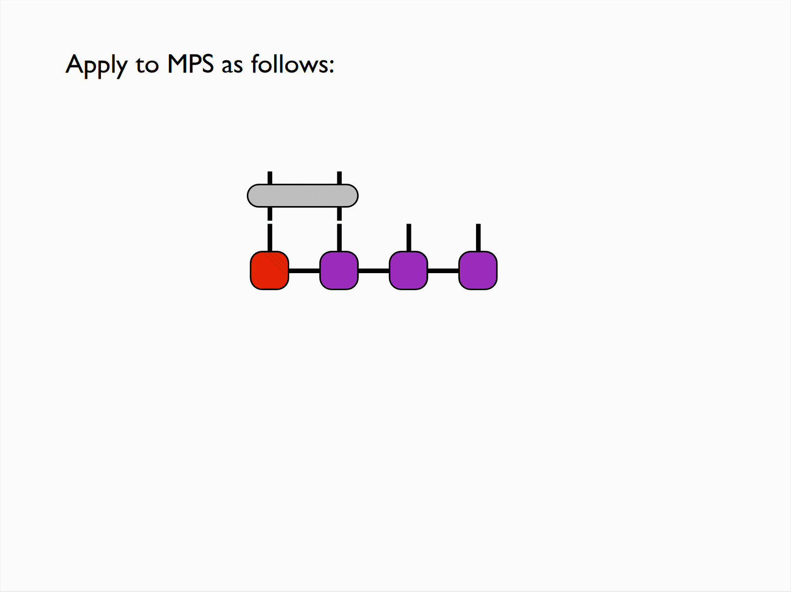

# one site 单节点

>Site
>
>意指"节点".

单节点的自旋为 $\frac{1}{2}$ 的波函数,有两个基底.

$|s=1\rangle=|\uparrow\rangle;|s=2\rangle=|\downarrow\rangle$

对于一般的自旋为 $\frac{1}{2}$ 的波函数,可以写成如下形式:

$|\psi\rangle=\sum_{s=1}^{2}\psi_s|s\rangle(\psi_s\in\mathcal{C})$

使用张量数学来处理这个单节点波函数,
即 $|\psi_s\rangle$ 对应一个有一个"触手"的结点.展开形式为 $(^{\psi_1}_{\psi_2})$ , $\psi_1,\psi_2$ 又各自是一个单"触手"的结点.

```cpp
Index s("s",2);
//"s"代表的是Index的命名
//2是Index的维度
ITensor psi(s);
//由于只声明不定义,所以初始值为0
```
>**Index 指标**
>
>指的是表示某种物理量的符号.这个符号
可以是矢量, 张量, 算符.
>
>```cpp
>Index s(2,"s");
>Index t(3,"t");
>ITensor T(s,t);
>```
>这个表示的就是创建了一个二维的物理量,我们用$s$来标记它;物理量t则是三维的.
而Itensor的大小则是 $2\times 3$.

对 $|\psi_s\rangle$ 进行初始化操作.我们不妨将其初始化为基矢:

$|\psi_s\rangle=|\uparrow\rangle$

```cpp
Index s(2,"s");
//在最新的ITensor语法规范中,Index (string, int)的语法已经被弃用
//目前的语法应当是Index (int, string)
ITensor psi(s);
psi(s(1)) = 1;
PrintData(psi);
```

本示例代码应该会输出:

```bash
psi = 
ITensor ord=1: (dim=2|id=414|"s") 
{norm=1.00 (Dense Real)}
(1) 1.0000000
```

## Operators 操作符/算子 $\hat{A}$

算子体现在张量网络上就是一个拥有两个"触手"的结点, 它可以和只有一个"触手"的结点结合, 从而生成一个新的只有一个触手的结点.

```cpp
ITensor Sz(s,prime(s));
ITensor Sx(s,prime(s));
//prime(s)是指的对s进行共轭操作
```

如果要对一个向量或者矩阵进行转置,共轭等操作,我们可以用被称为**上下标**的操作来表示.比如, $A_{ij}^{'}=A_{ji}$, $A^{\dagger}_{ij}=A_{ji}$ 等.

```prime(s)```就代表了对指标进行上标操作所得到的量.

>**Prime Level** 上标级别
>
>指标有一个属性被称为**prime level**, 表示是否被某个操作升降级.默认情况下指标的上标级别为0.
>
>这个量的作用是用来对两个张量进行比较, 在进行某些操作时, 上标必须要满足某些需求运算才能够成立.
>
>比如
>```cpp
>Index s(2,"s");
>Index t(2,"2");
>ITensor A(s,t);
>ITensor B(s,t);// s, t 都是上标级别为 0 的指标
>C = A * prime(B);// prime(B) 表示将 B 中的所有指标上标级别加 1
>```
>在这里, ```A * prime(B)```就是一个不允许指标重复的操作.所以为了完成这个计算,我们需要对```B```进行上标级别升级的操作,也就是使用```prime()```函数.

现在我们来对 $\hat{S}_z,\hat{S}_x$ 算子进行定义.
```cpp
ITensor Sz(s,prime(s)),Sx(s,prime(s));

// commaInit(Sz,s,prime(s)) =  0.5, 0.0,
//                             0.0,-0.5;
// commaInit(Sx,s,prime(s)) =  0.0, 0.5,
//                             0.5, 0.0;
//commaInit的语法已经被弃用, 应当使用.set()
//Sz
Sz.set(s(1),prime(s)(1),0.5);
Sz.set(s(2),prime(s)(2),-0.5);
//Sx
Sx.set(s(1),prime(s)(2),0.5);
Sx.set(s(2),prime(s)(1),0.5);//设置分量
```
现在我们尝试对波函数 $|\psi\rangle$ 进行求某方向自旋的操作.

即方程上的

$(\hat{S}_{x})_{s'}^{s}\psi_{s}$

对应的是
```cpp
ITensor phi = Sx * psi;
```

(注意算符的上标要和波函数的下标相同, 这样的操作才是被允许的. $s$和$s'$的上标等级不同, 所以是不匹配的)

为了研究经过求自旋的量 $|\phi\rangle$ 的具体情况, 我们将其输出在终端:

```cpp
ITensor phi = Sx * psi;
PrintData(phi);
```
输出的结果应该是:
```bash
phi = 
ITensor ord=1: (dim=2|id=816|"s")' 
{norm=0.50 (Dense Real)}
(2) 0.5000000
```
我们来看看更多的结果. 如果有 $|\psi_s\rangle=(|^{\cos{\frac{\theta}{2}}}_{\sin{\frac{\theta}{2}}}\rangle)_{\theta=\frac{\pi}{4}}$, 那么我们可以这样描述:

```cpp
Real theta = Pi/4;
// psi(s(1)) = cos(theta/2);
// psi(s(2)) = sin(theta/2);
//该语法已被弃用,使用.set()替代
psi.set(s(1),cos(theta/2));
psi.set(s(2),sin(theta/2));
PrintData(psi);
```
终端会输出
```bash
psi = 
ITensor ord=1: (dim=2|id=977|"s") 
{norm=1.00 (Dense Real)}
(1) 0.9238795
(2) 0.3826834
```
## 期望值 $\langle\hat{A}\rangle$
在物理上我们定义算符 $\hat{A}$ 的期望值为 $\langle\psi|\hat{A}|\psi\rangle$. 

我们不妨求自旋算符 $\hat{S_z}$ 的期望值. 在张量网络上, 这个过程体现为, 作为算符的"具有上下两个触手的结点"的每个触手分别连接一个"只有单触手的结点"(也就是代表着单节点波函数).

我们用程序语言来描述这个过程:
```cpp
ITensor cpsi = dag(prime(psi));
// Real zz = (cpsi * Sz * psi).toReal();
// Real xx = (cpsi * Sx * psi).toReal();
// toReal()函数已弃用,使用.real()替代
Real zz = (cpsi * Sz * psi).real();
Real xx = (cpsi * Sx * psi).real();
// println("<Sz>=",zz);
// println("<Sx>=",xx);
// println()已弃用,使用printfln()替代
printfln("<Sz>=",zz);
printfln("<Sx>=",xx);
```
其中```ITensor cpsi = dag(prime(psi));```就是一个将 $\psi$ 先取转置后取共轭的过程, 所以```cpsi```的上标级数为$2$. 我们也可以推测得知, 算符 $\hat{S}_x,\hat{S}_z$的上标级数为$1$.

终端输出为

```bash
<Sz>=0.353553
<Sx>=0.353553
```

观察到 $\sqrt{\langle S_z\rangle ^2 + \langle S_x\rangle ^2} = \frac{1}{2}$ 

我们可以将这个过程进行类似结合率的分析:

$\langle\psi|\hat{S}_z|\psi\rangle = \langle\psi|\hat{S}_z\psi\rangle$.

用代码来描述结合律的过程:
```cpp
ITensor Zpsi = Sz * psi;
//因为Sz以s为上标,psi以s为下标,所以允许运算
ITensor expect = cpsi * Zpsi;
Real zz = expect.real()
```

## Quiz $1$ 解析

>提示
>
>原文所提示的函数```elt()```已经弃用.所以采用的是传统的```prime(A) * B```方式. 如果你想使用函数而非 ```*```来得到内积, 你应当采用函数```inner()```

```cpp
#include "itensor/all.h"
#include "itensor/util/print_macro.h"

using namespace itensor;

int main(){
    // Define our Index 
    // (the space we are working with)
    auto s = Index(2,"s");

    // Operators 
    auto Sx = ITensor(s,prime(s));
    Sx.set(s(1),prime(s)(2),0.5);
    Sx.set(s(2),prime(s)(1),0.5);
    PrintData(Sx);

    // Single-site wavefunction
    auto psi = ITensor(s); //initialized to zero

    // TODO 
    // 1. make the above wavefunction
    //    the (normalized) positive Sx eigenstate

    psi.set(s(1),1/sqrt(2));
    psi.set(s(2),1/sqrt(2));
    PrintData(psi);

    // TODO
    // 2. Compute |phi> = Sx |psi> using
    //    the Sx and psi ITensors above
    //    AND
    //    compute: auto olap = <psi|phi>
    //    using the * operator and elt(...) method.
    //    Print the result with PrintData(...).
    auto phi = Sx * psi;
    auto olap = prime(psi) * phi;
    //auto olap = elt(prime(psi),phi);
    PrintData(olap);

    // TODO
    // 3. Try normalizing |phi> and recompute
    //    the inner product <psi|phi>
    //    Print the result with PrintData(...).
    //    HINT: use phi /= norm(phi)) to normalize.

    phi /= norm(phi);
    //auto olap2 = eltC(prime(psi),phi);
    auto olap2 = prime(psi) * phi;
    PrintData(olap2);

    return 0;
}
```
输出得到:

```bash
Sx = 
ITensor ord=2: (dim=2|id=15|"s") (dim=2|id=15|"s")' 
{norm=0.71 (Dense Real)}
(2,1) 0.5000000
(1,2) 0.5000000

psi = 
ITensor ord=1: (dim=2|id=15|"s") 
{norm=1.00 (Dense Real)}
(1) 0.7071068
(2) 0.7071068

olap = 
ITensor ord=0: 
{norm=0.50 (Dense Real)}
  0.5000000

olap2 = 
ITensor ord=0: 
{norm=1.00 (Dense Real)}
  1.0000000
```

# Two Sites 双节点

## 纠缠态

对于双自旋的波函数, 我们一般的描述方程是:

$|\Psi\rangle = \sum_{s_1,s_2 = 1}^{2}\psi_{s_1s_2}|s_1\rangle|s_2\rangle$

体现在张量网络上, 就是一个结点在同一方向上同时有着两个"触手". 
对于我们写出来的态,我们可以分离出两个单态(Singlet).

程序上的描述方法:
```cpp
// Index s1(2,"s1",Site), s2(2,"s2",Site);
// 该语法已经被弃用,使用两步语法来替代
Index s1(2,"s1");s1.addTags("Site");
Index s2(2,"s2");s1.addTags("Site");
ITensor psi(s1,s2);                 //只声明不定义,则默认为0
// psi(s1(1),s2(2)) = 1./sqrt(2);
// psi(s1(2),s2(1)) =-1./sqrt(2);
// 该语法已被弃用,使用.set()来替代.
psi.set(s1(1),s2(2), 1./sqrt(2));
psi.set(s1(2),s2(1),-1./sqrt(2));
PrintData(psi);
```
>```Index s1(2,"s1");s1.addTags("Site");```代表的含义是创建一个维数为```int```,标签(或者理解为"名字",一般是指物理上的状态,比如自旋,粒子位置等等)为```string```,指标类型为```Site```的物理量.同时使用```ITensor psi(s1,s2)```将```s1```和```s2```设置为纠缠态(**Entangled State**).

现在要说明的就是指标(```Index```)的类型:```Site```和```Link```.

```Site```表示单个量子位的物理态. 适用于表示单个自旋,单个粒子的位置等等. 与之配对的维数```int```表示的是该量子位可以取的物理态的数量;

```Link```表示的是不同量子位之间的相互作用. 这种相互作用通常表示不同量子位的链接, 适用于表示各种相互作用, 比如哈密顿量等.

~~(还有表示不同于```Site```和```Link```类型的其它指标类型, 比如```Bulk```)~~

上面的代码中我们用```Site```来标记两个量子位,并且使其结合为纠缠态. 

结果输出为

```bash
psi = 
ITensor ord=2: (dim=2|id=324|"s1,Site") (dim=2|id=127|"s2") 
{norm=1.00 (Dense Real)}
(2,1) -0.707107
(1,2) 0.7071068
```

## 哈密顿量$\hat{H}$

我们写出双自旋系统的哈密顿量方程:

$\hat{H}=\hat{S}_1\cdot\hat{S}_2=S_1^zS_2^z+\frac{1}{2}S_1^+S_2^-+\frac{1}{2}S_1^-S_2^+$

其中 $S_1^\pm, S_2^\pm$ 是升降算符. 我们在程序中这样创建:

```cpp
Index s1(2,"s1");s1.addTags("Site");
Index s2(2,"s2");s1.addTags("Site");

ITensor Sz1(s1,prime(s1)),Sp1(s1,prime(s1)),Sm1(s1,prime(s1));
ITensor Sz2(s2,prime(s2)),Sp2(s2,prime(s2)),Sm2(s2,prime(s2));

// commaInit(Sp1,s1,prime(s1)) =   0, 1,
//                                 0, 0;
// commaInit语法已被弃用.

//Sz1,Sz2
Sz1.set(s1(1),prime(s1)(1),0.5);Sz1.set(s1(2),prime(s1)(2),-0.5);
Sz2.set(s2(1),prime(s2)(1),0.5);Sz2.set(s2(2),prime(s2)(2),-0.5);

//Sp1,Sp2
Sp1.set(s1(1),prime(s1)(2),1);Sp2.set(s2(1),prime(s2)(2),1);

//Sm1,Sm2
Sm1.set(s1(2),prime(s1)(1),1);Sm2.set(s2(2),prime(s2)(1),1);

ITensor H = Sz1 * Sz2 + 0.5 * Sp1 * Sm2 + 0.5 * Sm1 * Sp2;
PrintData(H);//你也可以尝试执行printfln("H=",H);
```

执行后可以得到结果
```bash
H = 
ITensor ord=4: (dim=2|id=397|"s1,Site") (dim=2|id=397|"s1,Site")' (dim=2|id=53|"s2") (dim=2|id=53|"s2")' 
{norm=0.87 (Dense Real)}
(1,1,1,1) 0.2500000
(2,2,1,1) -0.250000
(1,2,2,1) 0.5000000
(2,1,1,2) 0.5000000
(1,1,2,2) -0.250000
(2,2,2,2) 0.2500000
```

>这表明这是一个四阶张量,并且由索引```s1```, ```s1'```, ```s2```, ```s2'```来描述. 它们各自的维度都是$2$, 即它们可以取值为$1$或$2$.这就是```(i,j,k,l)```中```1```或者```2```的含义, 后面的值是对应的张量元素.

这样计算得来的 $\hat{H}$ 在张量网络中表示一个上下各自有两个"触手"的结点, 恰好可以和表现为在某一方向上拥有两个"触手"的纠缠态结点进行结合.

更具体地说, 我们上面创建的 $\hat{H}$ 的上标是```s1'```和```s2'```,下标是```s1```和```s2```;
而 $\psi$ 的上标是```s1```和```s2```,两者进行结合就可以得到只有两个上标```s1'```和```s2'```的新节点 $\hat{H}\psi$ .

程序上这样描述这个结合的过程:

```cpp
ITensor Hpsi = H * psi;
//Hpsi.mapprime(1,0);//该语句的作用是将Hpsi中所有上标级别为1的索引全部降为0,使得之后的运算能够被允许
//该语法已被弃用. 使用.noPrime()来代替
Hpsi.noPrime();
Real E = (dag(psi) * Hpsi).real();
//Print()语法已被弃用, 使用PrintData()来代替.
PrintData(E);
```
能够在终端得到输出
```bash
E = -0.75
```

当然这个过程也可以一行语句完成:
```cpp
Real E = (dag(prime(psi)) * H * psi).real();
PrintData(E);
```
输出的结果同样是
```bash
E = -0.75
```
## Quiz $2$ 解析
>这个题目的背景是, 使用虚时间演化的方式来找到哈密顿量所对应的基态. 对应的方程是
>
>$e^{-\beta H/2}|0\rangle\propto|\Psi_0\rangle$

```cpp

#include "itensor/all.h"
#include "itensor/util/print_macro.h"

using namespace itensor;

//定义生成Sp Sm Sz的函数
ITensor makeSp(Index const& s){
    auto Sp = ITensor(s,prime(s));
    Sp.set(s=2,prime(s)=1, 1);
    return Sp;
}

ITensor makeSm(Index const& s){
    auto Sm = ITensor(s,prime(s));
    Sm.set(s=1,prime(s)=2,1);
    return Sm;
}

ITensor makeSz(Index const& s){
    auto Sz = ITensor(s,prime(s));
    Sz.set(s=1,prime(s)=1,+0.5);
    Sz.set(s=2,prime(s)=2,-0.5);
    return Sz;
}

int main(){
    // Initial product state
    auto s1 = Index(2,"s1");auto s2 = Index(2,"s2");
    auto psi = ITensor(s1,s2);
    psi.set(s1=1,s2=2,1.0);
    PrintData(psi);

    // Single-site operators
    auto Sz1 = makeSz(s1);auto Sz2 = makeSz(s2);
    auto Sp1 = makeSp(s1);auto Sp2 = makeSp(s2);
    auto Sm1 = makeSm(s1);auto Sm2 = makeSm(s2);

    // Two-site Heisenberg Hamiltonian
    auto H = Sz1 * Sz2 + 0.5 * Sp1 * Sm2 + 0.5 * Sm1 * Sp2;

    // Initial energy expectation value
    auto initEn = elt(dag(prime(psi)) * H * psi);
    printfln("\nInitial energy = %.10f",initEn);

    // Make exp(-beta*H)
    // TODO
    // 3. Adjust beta to get the ground state

    Real beta = 0.1;
    auto expH = expHermitian(H,-beta);

    // Here we apply exp(-beta*H), normalize
    // and unprime
    auto psibeta = expH * psi;
    psibeta.noPrime();
    psibeta /= norm(psibeta);
    PrintData(psibeta);

    auto En = elt(dag(prime(psibeta)) * H * psibeta);
    printfln("At beta=%.1f, energy = %.10f",beta,En);

    // TODO
    // 1. Adjust the following code to
    //    truncate to dimension 1.
    //    HINT: use the ITensor named argument
    //    system, e.g. {"MaxDim=",...}

    auto [U,D,V] = svd(psibeta,{s1},{"MaxDim=",1});
    PrintData(D);

    // TODO
    // 2. Calculate the overlap of the new
    //    wavefunction with the old wavefunction.
    //    Print your results with PrintData(...).
    //    HINT: use U*D*V to calculate the new,
    //    truncated wavefunction 

    auto newpsi = U * D * V;
    PrintData(newpsi);
    Real op = (dag(prime(newpsi)) * H * psibeta).real();
    PrintData(op);

    // TODO
    // 3. Increase beta (defined above) to get the
    //    ground state. How does the overlap 
    //    change?

    return 0;
}
```

输出得到.

```bash
psi = 
ITensor ord=2: (dim=2|id=311|"s1") (dim=2|id=239|"s2") 
{norm=1.00 (Dense Real)}
(1,2) 1.0000000


Initial energy = -0.2500000000
psibeta = 
ITensor ord=2: (dim=2|id=311|"s1") (dim=2|id=239|"s2") 
{norm=1.00 (Dense Real)}
(2,1) -0.049896
(1,2) 0.9987544

At beta=0.1, energy = -0.2998339973
D = 
ITensor ord=2: (dim=1|id=426|"U,Link") (dim=1|id=228|"V,Link") 
{norm=1.00 (Diag Real)}
(1,1) 0.9987544

newpsi = 
ITensor ord=2: (dim=2|id=311|"s1") (dim=2|id=239|"s2") 
{norm=1.00 (Dense Real)}
(1,2) 0.9987544

op = -0.274295
```

所以只要我们一直调整```beta```的取值反复编译执行, 最后就能够找到能量最低时所对应的```beta```值.

# SVD 奇异值分解
>**Singular Value Decomposition**
>
>如果M是 $m\times m$ 的矩阵, 那么一定存在这样一个式子:
>
>$M = U \Sigma V^*$
>
>其中$U$是 $m\times m$ 的酉矩阵, 
$\Sigma$ 是 $m\times n$ 非负实数对焦矩阵, 
$V^*$ 是 $n\times n$ 的酉矩阵. 
>
>其中 $\Sigma$ 对角线上的元素 $\Sigma_{i,i}$ 是 $M$ 的奇异值.

>密度矩阵重整化群 **Density Matrix Renormalization Group**
>
>该方法通过矩阵乘积态(Matrix Product State,MPS)来表示量子多体系统的波函数等.
>DMRG方法来源于密度矩阵的理论和重整化群的思想, 大幅减少系统自由度的同时保留了系统中的物理特征.

对于

$$
M=
\begin{bmatrix}
0.435839 & 0.223707 & 0.10\\
0.435839 & 0.223707 & -0.10 \\
0.223707 & 0.435839 & 0.10 \\
0.223707 & 0.435839 & -0.10 \\
\end{bmatrix}
$$

可以分解为 $A * D * B$:

$$
\begin{bmatrix}
0.5 &-0.5 & 0.5 \\
0.5 &-0.5 &-0.5 \\
0.5 & 0.5 & 0.5 \\
0.5 & 0.5 &-0.5 \\
\end{bmatrix}*
\begin{bmatrix}
0.933 & 0 & 0 \\
0 & 0.300 & 0 \\
0 & 0 & 0.200 \\
\end{bmatrix}*
\begin{bmatrix}
 0.707107 & 0.707107 & 0 \\
-0.707107 & 0.707107 & 0 \\
0 & 0 & 1 \\
\end{bmatrix}
$$

可以看出, 两边的矩阵 $A,B$ 满足酉矩阵的定义, 即有 $A^{\dagger}A=I,BB^{\dagger}=I$.而对角矩阵 $D$ ,元素是非负实数且降序排列.

如果我们从后往前一步步去除 $D$ 对角线上的元素, 即

$$
\begin{bmatrix}
0.933 & 0 & 0 \\
0 & 0.300 & 0 \\
0 & 0 & 0.200 \\
\end{bmatrix}
\rightarrow
\begin{bmatrix}
0.933 & 0 & 0 \\
0 & 0.300 & 0 \\
0 & 0 & 0 \\
\end{bmatrix}
\rightarrow
\begin{bmatrix}
0.933 & 0 & 0 \\
0 & 0 & 0 \\
0 & 0 & 0 \\
\end{bmatrix}
$$

这种操作被称为截断(Truncating).

然后依次重新进行 $M_{i} = A * D_{i} * B$ 合成,
并且使用范数 $||M_i - M||^2$ 来对合成后的矩阵产生的偏差程度进行评估.我们将可以看到:

$$
||M - M||^2 = 0;\\
||M - M_1||^2 =  (0.2)^2;\\
||M - M_2||^2 = (0.2)^2 + (0.3)^2;
$$

我们不难看出, 其实截断就是在降低矩阵 $D$ 的秩, 通过把握这个截断的幅度, 我们就可以控制最后产生 $M_i$ 矩阵的偏差程度. 这是一个用精度换速度的过程.

## 双自旋波函数

我们不妨用更物理一点的背景来分析奇异值分解的过程.

对于一个纠缠态的双自旋系统, 我们已经知道可以处理为一个具有两个"触手"(即上标)的结点. 但是我们也可以将其作为一个矩阵来处理, 即一个拥有左右两个"触手"的结点.

$-^{s_1} -\square\square\square^{\psi}-^{s_2}-$

这样, 我们就可以对中间的结点进行SVD操作, 这样就形成了一个项链式的结构:

$-^{s_1} -\square^{A}-\square^{D}-\square^{B}-^{s_2}-$

这种波函数形式, 我们将其称之为"矩阵乘积态"(**Matrix Product State,MPS**).

为了让这个结构看上去更像是一个波函数,可以想象两侧的"触手"是向上的(上标).

不妨用程序来描述这个过程.
```cpp
ITensor A(s1),D,B;  //先声明后使用
svd(psi,A,D,B);
```

我们已经知道, 对于一个寻常的双自旋波函数, 我们需要 $(2s + 1)^2$ 个参数来进行描述. 而且一般情况下, 我们对于这些参数的重要程度是无知的.无法放弃任何一个参数, 这就会急剧增加计算量.

而SVD给了我们一种可能: 我们不仅能知道哪些参数最重要, 我们还可以很大程度上掌握它们的数量, 而且这个数量很有可能很少(有利于计算!).

我们用方程来表达矩阵乘积态的思想:

$$
|\Psi\rangle=\sum_{s_1,\alpha,\alpha',s_2}A_{s_1\alpha}D_{\alpha\alpha'}B_{\alpha's_2}|s_1\rangle|s_2\rangle
$$

>当然我们也可以将矩阵 $A,D$ 预先相乘形成新矩阵 $\psi$, 张量网络的形式即为:
>
>$-^{s_1} -[\#]^{A}-[\#]^{D}-[\#]^{B}-^{s_2}-$
>
>$\downarrow$
>
>$-^{s_1} -[\#\#]^{\psi}-[\#]^{B}-^{s_2}-$
>
>这样我们就得到了
>
>$$
>|\Psi\rangle=\sum_{s_1,\alpha',s_2}\psi_{s_1\alpha'}B_{\alpha's_2}|s_1\rangle|s_2\rangle
>$$

>同理, 我们也可以将矩阵 $D,B$ 预先相乘形成新矩阵 $\psi$, 张量积算网络的形式为
>
>$-^{s_1} -\square^{A}-\square^{D}-\square^{B}-^{s_2}-$
>
>$\downarrow$
>
>$-^{s_1} -\square^{A}-\square^{\psi}-^{s_2}-$
>
>这样我们就得到了
>
>$$
>|\Psi\rangle=\sum_{s_1,\alpha,s_2}A_{s_1\alpha}\psi_{\alpha s_2}|s_1\rangle|s_2\rangle
>$$

## Quiz $3$ 解析

```cpp
#include "itensor/all.h"
#include "itensor/util/print_macro.h"

using namespace itensor;

int main(){
    // SVD of matrix M
    int Nrow = 4;int Ncol = 3;
    auto maxdim = std::min(Nrow,Ncol);//确定截断维度

    auto M = Matrix(Nrow,Ncol);
    M(0,0) = 0.435839; M(0,1) = 0.223707; M(0,2) = 0.10;
    M(1,0) = 0.435839; M(1,1) = 0.223707; M(1,2) = -0.10;
    M(2,0) = 0.223707; M(2,1) = 0.435839; M(2,2) = 0.10;
    M(3,0) = 0.223707; M(3,1) = 0.435839; M(3,2) = -0.10;//初始化矩阵
    Print(M);

    //声明变量的数据类型
    Matrix U,V;
    Vector d;//用来接收对角元素,即奇异值
    SVD(M,U,d,V);

    Print(U);Print(d);Print(V);

    int nkeep = 2;//取矩阵的截断维度
    auto Dtrunc = Matrix(maxdim,maxdim);//只声明不定义,则初始化为0
    for(auto j : range(nkeep)){
        Dtrunc(j,j) = d(j);
    }//在对角线上填上截断保留的奇异值

    auto Mtrunc = U*Dtrunc*transpose(V);//重新结合形成采取截断后的矩阵
    Print(Mtrunc);

    auto diff = norm(M-Mtrunc);auto diff2 = sqr(diff);//取矩阵差的范数来评估截断的效果(diff)

    printfln("|M-Mtrunc|^2 = %.2f",diff2);
    
    // SVD of two-site wavefunction
    auto s1 = Index(2,"s1");auto s2 = Index(2,"s2");//声明指标

    auto sing = ITensor(s1,s2);auto prod = ITensor(s1,s2);

    //Make sing a singlet
    sing.set(s1=1,s2=2, 1./sqrt(2));sing.set(s1=2,s2=1,-1./sqrt(2));
    //Make prod a product state
    prod.set(s1=1,s2=2,1.);

    for(Real mix = 0; mix <= 1.; mix += 0.1){
        // TODO: ADD CODE here to create
        // a new wavefunction that is 
        // (1-mix) times a product state plus (mix)
        // times a singlet (i.e. maximally entangled state).
        auto wf = (1. - mix) * prod + mix * sing;
        wf /= norm(wf);
        //PrintData(wf);
        // SVD this wavefunction and analyze the results.
        // Try computing and plotting the entanglement entropy.
        
        ITensor A(s1),D,B;
        Spectrum spec = svd(wf,A,D,B);
        //PrintData(U);PrintData(D);PrintData(V);

        auto ent = 0.;
        //.eig(n)返回的是第(n+1)个本征值,这是因为数组下标从0开始;.numEigsKept()则是表示的特征值的数目
        for(int n = 0;n < spec.numEigsKept();n++){
            auto P = sqr(spec.eig(n));
            if(P > 0) ent -= P*log(P);
        }
        //分别以两位小数和六位小数的形式输出
        printfln("mix = %.2f, entropy = %.6f\n", mix, ent);
    }
    return 0;
}

```
为了节省篇幅,原本需要多次执行的```PrintData()```函数被注释了. 如果你有查看其具体数值的需要可以在自己使用的时候启用.

编译完成执行,在终端输出:
```bash
M = 
|0.4358390 0.2237070 0.1000000|
|0.4358390 0.2237070 -0.100000|
|0.2237070 0.4358390 0.1000000|
|0.2237070 0.4358390 -0.100000|

U = 
|0.5000000 0.5000000 0.5000000|
|0.5000000 0.5000000 -0.500000|
|0.5000000 -0.500000 0.5000000|
|0.5000000 -0.500000 -0.500000|

d = 0.932739 0.3 0.2 
V = 
|0.7071068 0.7071068 1.11671818E-16|
|0.7071068 -0.707107 -8.81355030E-17|
|-1.66426876E-17 -1.41285111E-16 1.0000000|

Mtrunc = 
|0.4358390 0.2237070 -2.89544043E-17|
|0.4358390 0.2237070 -2.89544043E-17|
|0.2237070 0.4358390 1.34311222E-17|
|0.2237070 0.4358390 1.34311222E-17|

|M-Mtrunc|^2 = 0.04
mix = 0.00, entropy = 0.000000

mix = 0.10, entropy = 0.010473

mix = 0.20, entropy = 0.042683

mix = 0.30, entropy = 0.094817

mix = 0.40, entropy = 0.160729

mix = 0.50, entropy = 0.230729

mix = 0.60, entropy = 0.293765

mix = 0.70, entropy = 0.340279

mix = 0.80, entropy = 0.364548

mix = 0.90, entropy = 0.365602

mix = 1.00, entropy = 0.346574
```

# Four 四结点

对于四节点的矩阵乘积态，我们可以用这样一个方程式来描述：

$$
|\Psi\rangle=\sum_{\{s\},\{\alpha\}}M_{\alpha_1}^{s_1}M_{\alpha_1\alpha_2}^{s_2}M_{\alpha_2\alpha_3}^{s_3}M_{\alpha_4}^{s_4}|s_1s_2s_3s_4\rangle
$$

前面我们已经学习过怎么处理将两个单节点结合为纠缠态的双节点. 所以我们这里可以将具有 $s_3$ 和 $s_4$ 上标的两个单节点组合形成具有 $s_3$ 和 $s_4$ 上标的纠缠态双节点.

然后就是刚才所学的将双节点进行SVD分解, 而这里我们要分解的对象就是刚才合成的纠缠态双节点。

为了继续保持四节点的性质，我们将分解出的```A```,```D```和```B```中的```A```与```D```结合,其上标是 $s_3$ ,而剩下来的```B```则单独作为结点, 其上标是 $s_4$.

以这种方式得到的新的四节点张量, 我们称之为"右正交"(**Right Orthogonal**)或者说"右规范", 这是因为单独作为结点的 $B$ 是 酉的 ($BB^{\dagger}=I$).

显然, 这种右正交的性质是可以向左传递的. 比如, 我们取已经完成了**SVD**和**AD**结合的四节点张量中的具有 $s_2$ 和 $s_3$ 上标的单节点重复上述操作, 便可以让具有上标 $s_3$ 的单节点也具有右正交的性质.依此类推, 使得除了 $s_1$ 之外的所有单节点都具有右正交的性质.

## 期望值 $\langle\hat{A}_1\rangle$

我们考虑一个具有4量子位的纠缠态波函数求第一量子位算符的期望值的过程. 

在一般情况下,我们通常是这样求解的(假设 $|\psi\rangle$ 已经规一化):

$$
\langle\hat{A}_1\rangle=\sum_{s}\overline{\psi}_{s'_1s_2s_3s_4}A_{s'_1s_1}\psi_{s_1s_2s_3s_4}
$$

这个过程显然是及其繁杂的, 在这种情况下时间复杂度以 $O(2^n)$ 的速度增长, 如果不以某种算法进行简化必然极其耗时.

如果是已经经过了SVD分解的纠缠态波函数, 除了第一量子位 $s_1$ , 其余的所有单节点全部都具有右正交性质, 而我们求的是第一量子位的算符的期望值, 这也意味着其余量子位结合不会对第一量子位的运算产生任何影响.

通过这样的算法, 计算量得到了大量简化.

用程序语言来描述这个过程:

```cpp
SpinHalf sites(N);  //表示sites是N个1/2自旋量子位的体系
MPS psi(sites);     //以矩阵乘积态表示sites体系的波函数, 并且用psi来称呼这个波函数
computeGroundState(H,psi);//寻找哈密顿量H下的基态, psi被用以进行初始化
psi.position(2);//将psi的正则位置设置为第二个位置.

Real sz_expect = (dag(prime(psi.A(2),Site)) * sites.op("Sz",2) * psi.A(2)).real();
```

>正则位置**Canonical Position**
>
>在前面的SVD和regroup过程中我们只提到了"右规范", 实际上我们也很容易将其推广到"左规范", 这样的话我们就可以将正则位置定义为"左规范"和"右规范"同时成立的位置.
>
>在上面的例子中,因为我们要求的是第二量子位的自旋期望值, 为了简化我们就要将其左右的全部结点都规范化(具体结合的方向看正则位置的左右).

## Quiz $4$ 解析

>矩阵乘积算子**Matrix Product Operator**(**MPO**)
>
>和矩阵乘积态(**MPS**)相似, **MPO**也是一种张量网络的表示方法. 
它可以用来描述复杂量子系统的哈密顿量.

```cpp
#include "itensor/all.h"
#include "itensor/util/print_macro.h"

using namespace itensor;
using std::vector;

int main(){
    int N = 50;//定义一个包含50个1/2自旋的系统'sites'
    auto sites = SpinHalf(N,{"ConserveQNs=",false});//"ConserveQNs="设为false,表示不考虑量子数守恒.

    // TODO
    // 3. Adjust the external field to see how the
    //    magnetization changes

    Real h = 0.5;
    //调整h来找到相变点.h = 1 时,系统从磁性相变无序相. 

    // Create the MPO for the transverse field
    // Ising model
    auto ampo = AutoMPO(sites); //创建一个自动构造MPO的对象'ampo'
    //依次赋值
    for(int j = 1; j < N; ++j){
        ampo += -4.0,"Sz",j,"Sz",j+1;
    }
    for(int j = 1; j <= N; ++j){
        ampo += -2*h,"Sx",j;
    }
    //哈密顿量的类型是MPO, 利用toMPO()函数将ampo里蕴含的信息转化为哈密顿量
    auto H = toMPO(ampo);

    // Create a random starting state
    // For DMRG
    //随机生成一个初始态
    auto psi0 = randomMPS(sites);

    // Run DMRG to get the ground state
    auto sweeps = Sweeps(5);        //设置密度矩阵重整化群算法(DMRG)的最大迭代次数
    sweeps.maxdim() = 5,10,20;      //设置密度矩阵重整化群算法(DMRG)的最大纠缠矩阵维度的序列
    sweeps.cutoff() = 1E-10;        //设置奇异值的截断精度, 只有大于该值的奇异值才会被保留
    auto [E,psi] = dmrg(H,psi0,sweeps,{"Quiet",true});
    //H为系统的哈密顿量, 以psi0作为迭代起点运行算法,
    //'sweeps'是迭代的参数,
    //'{"Quiet",true}'表示静默运行(不输出详细的迭代信息)
    //返回值为基态能量和基态波函数, 以量 E 和 psi 对计算结果进行存储
    //在终端查看基态能量值
    printfln("Ground state energy = ",E);

    // 对psi进行共轭转置. 此时psidag上标级别为2.
    auto psidag = dag(prime(psi));

    // A vector holding the operators used
    // in the expectation value.
    // All set to identity operators to start.
    // Note: this is one-indexed 
    //       (O[n] is the operator on site n)
    //创建长为N+1的向量, 用于存储测量算符.O[j]代表在第j个量子位上的测量算符
    auto O = vector<ITensor>(N+1);
    //对O进行初始化,方法是将所有的测量算符都设为单位算符
    for(auto j : range1(N)){
        O[j] = op(sites,"Id",j);      //"Id"意指"Identity", 即单位算符
    }

    // Position we will place our operator
    // 将本征位置选为正中, 即N/2.以这个位置来执行测量
    int Npos = N/2;

    // TODO
    // 1. Add an operator to measure the magnetization
    //    in the z direction at Npos.
    //    HINT: use the op(...) function.
    //          It provides spin operators "Sx", "Sy", "Sz",
    //          you may want to scale your operator
    //          to make it a Pauli matrix
    auto op_z = 2.0 * op(sites,"Sz",Npos);
    O[Npos] = op_z;

    // TODO
    // 2. Complete the following code 
    //    to measure the magnetization.
    //    Print your results with PrintData(...)

    auto o = psidag(1) * O[1] * psi(1);
    for(auto j : range1(2,N)){
        o *= psidag(j) * O[j] * psi(j);
    }
    PrintData(o);

    // TODO
    // 3. Adjust the transverse field h at the top of the
    //    file to find the critical point.
    //    HINT: think about the field limits h -> 0
    //          and h -> infinity
    return 0;
}
```
编译执行后终端输出：
```bash
vN Entropy at center bond b=25 = 0.002062540436
    Eigs at center bond b=25: 0.9998 
    Largest link dim during sweep 1/5 was 4
    Largest truncation error: 4.11222e-11
    Energy after sweep 1/5 is -51.205898332822
    Sweep 1/5 CPU time = 0.0146s (Wall time = 0.0177s)

    vN Entropy at center bond b=25 = 0.006828488484
    Eigs at center bond b=25: 0.9992 
    Largest link dim during sweep 2/5 was 10
    Largest truncation error: 1.88078e-08
    Energy after sweep 2/5 is -51.298393038956
    Sweep 2/5 CPU time = 0.0181s (Wall time = 0.0181s)

    vN Entropy at center bond b=25 = 0.002920154202
    Eigs at center bond b=25: 0.9997 
    Largest link dim during sweep 3/5 was 18
    Largest truncation error: 9.69913e-11
    Energy after sweep 3/5 is -52.306536772989
    Sweep 3/5 CPU time = 0.0210s (Wall time = 0.0210s)

    vN Entropy at center bond b=25 = 0.002920148259
    Eigs at center bond b=25: 0.9997 
    Largest link dim during sweep 4/5 was 6
    Largest truncation error: 9.45633e-11
    Energy after sweep 4/5 is -52.306549436787
    Sweep 4/5 CPU time = 0.0179s (Wall time = 0.0180s)

    vN Entropy at center bond b=25 = 0.002920145615
    Eigs at center bond b=25: 0.9997 
    Largest link dim during sweep 5/5 was 5
    Largest truncation error: 9.18628e-11
    Energy after sweep 5/5 is -52.306549436806
    Sweep 5/5 CPU time = 0.0168s (Wall time = 0.0168s)
Ground state energy = -52.3065
o = 
ITensor ord=0: 
{norm=0.96 (Dense Real)}
  -0.964679
```

# ~~"小车"~~ Trotter – Suzuki formula

上一章中我们测量的是单个量子位的期望值, 当我们增加有效算子(指在该量子位上并非单位算符```"Id"```)的数量, 张量网络看上去就如同小车一般.

>~~上述语句均为强行解释~~.事实上这个算法来源于模拟哈密顿量动力学中的**Trotter – Suzuki formula**, **Trotter**到底是形容"小车"还是人名实际上并不太清楚.

现在我们设想一个已经对于相邻的两个量子位的左/右都已经完成左/右规范化,那么现在要做的就是计算这两个相邻量子位上对应算符的期望值.

和前面章节中处理二量子位的纠缠态类似, 我们可以将这两个量子位进行合并, 进行SVD分解, 再重组(至于是```AD```组合还是```DB```组合,可以根据自己需求来调整).

>注意: 这种算法仅适用于相邻量子位并不属于同一方向规范的情况(比如并不是两个正则位置, 而是在正则位置的同一边), 否则以截断SVD方法计算得到的结果并非全局最优.

Trotter算法的精髓在于,将哈密顿量(也就是我们所用的算子)分解为若干个可以独立演化的小块, 而且如果哈密顿量是短程相互作用, 那么这种分解的效果就更好. 对于长程作用的哈密顿量Trotter算法的效率就会明显降低.在上面我们所举的例子里, 有效的哈密顿量仅涉及两个相邻的量子位, 可以说是符合短程的定义.

如果哈密顿量中的相互作用都是短程的, 我们可以将哈密顿量分解为小块, 用自旋系统为例, 我们可以用这样的方程来描述:

$$
\begin{aligned}
\hat{H}&=\hat{H}_1+\hat{H}_2+\hat{H}_3+\dots \\

&=\sum_{j}\hat{S}_{j}\cdot\hat{S}_{j+1} \\

&=(\hat{S}_{1}\cdot\hat{S}_{2})+(\hat{S}_{2}\cdot\hat{S}_{3})+(\hat{S}_{3}\cdot\hat{S}_{4})\dots
\end{aligned}
$$

那么假设系统演化了一极短的虚时间 $\tau$,我们可以将系统的演化写作:

$$
\begin{aligned}
e^{-\tau\hat{H}}\approxeq &e^{-\tau\hat{H}_1/2}e^{-\tau\hat{H}_2/2}e^{-\tau\hat{H}_3/2}\dots\\
&\dots e^{-\tau\hat{H}_3/2}e^{-\tau\hat{H}_2/2}e^{-\tau\hat{H}_1/2}+O(\tau^3)
\end{aligned}
$$

>**虚时演化**
>
>对于一个一般的表达式 $|\psi'\rangle=e^{-\tau\hat{H}}|\psi\rangle$ (省略了 $\hbar$ ),有两种情况:
>- $\tau$ 是实数, 那么相当于 $\tau = i\tau'$, 其中 $\tau'$是虚时间. 那么我们只要执行足够多步, 就可以搜索到基态.
>- $\tau$ 是虚数, 那么就是一般的**动力学**表述, 相当于 $\tau = it$, 原方程变为 $|\psi'\rangle=e^{-it\hat{H}}|\psi\rangle$
>
>对于第一种情况, 有一种应用的例子, 即通过取 $\beta/2=1/(2T)$ 的虚时演化来模拟有限温度.
>
>更详细的说, 就是取 $\tau = \frac{1}{k_BT}$ ,就相当于进行了一次虚时间演化. 在每一步执行完成后我们要对系统的状态进行记录, 从而对系统的在温度T下的性质进行统计平均.

我们用.gif来演示这一过程:

<center></center>

因为我们每一步都只取了每个量子位对应分块哈密顿量的 $\frac{1}{2}$ ,所以通过往返执行一遍可以不改变纠缠态的规范性.


# Quiz 5 解析
```cpp
#include "itensor/all.h"
#include "itensor/util/print_macro.h"

using std::vector;
using std::move;
using namespace itensor;

struct TGate{
    int i1 = 0;int i2 = 0;
    //i1, i2是用来指定虚时演化算子中产生作用的两个自旋量子位编号
    ITensor G;
    //G被声明为ITensor类型，用来存储具体的虚时演化算子值

    TGate() { }
    TGate(int i1_, int i2_, ITensor G_) 
        : i1(i1_), i2(i2_), G(G_) { }
};

int main(){
    int N = 20;
    auto sites = SpinHalf(N);//声明系统是20个1/2自旋子的系统

    auto init = InitState(sites);
    for(auto n : range1(N)){
        init.set(n, n%2 == 1 ? "Up" : "Dn");
    }//并且将该系统初始化为Neel态(相邻自旋总相反)
    //将该状态init通过MPS()转译为矩阵乘积态(MPS)的形式
    auto psi = MPS(init);
    //定义虚时演化的总时间和时间间隔(步长)
    Real ttotal = 2;Real tstep = 0.1;
    //检查时间步长和总时间是否合法
    auto nt = int(ttotal/tstep+(1e-9*(ttotal/tstep)));
    if(std::fabs(nt*tstep-ttotal) > 1E-9){
        Error("Timestep not commensurate with total time");
    }

    //Create Trotter gates (imaginary time)
    //定义数据类型为TGate的vector容器，用来存储虚时演化算子
    auto gates = vector<TGate>{};

    for(int b = 1; b < N; ++b){
        //从头开始构建哈密顿量
        auto hh = op(sites,"Sz",b)*op(sites,"Sz",b+1);
        hh += 0.5*op(sites,"Sp",b)*op(sites,"Sm",b+1);
        hh += 0.5*op(sites,"Sm",b)*op(sites,"Sp",b+1);
        //计算半步长的虚时演化算子
        auto G = expHermitian(hh,-tstep/2.);
        //将虚时演化算子存储到名为gates的容器中(序列尾部)
        //b在每个循环中都有一个值. 下面的b和b+1是指应用算子的位置.
        gates.emplace_back(b,b+1,move(G));
    }
    for(int b = N-1; b >= 1; --b){
        //从尾开始构建哈密顿量
        ITensor hh = op(sites,"Sz",b)*op(sites,"Sz",b+1);
        hh += 0.5*op(sites,"Sp",b)*op(sites,"Sm",b+1);
        hh += 0.5*op(sites,"Sm",b)*op(sites,"Sp",b+1);
        //计算半步长的虚时演化算子
        auto G = expHermitian(hh,-tstep/2.);
        //将虚时演化算子存储到名为gates的容器中(序列尾部)
        //b在每个循环中都有一个值. 下面的b和b+1是指应用算子的位置.
        gates.emplace_back(b,b+1,move(G));
    }
    

    for(int step = 1; step <= nt; ++step){
        //将之前计算存储好的分块算子一一取出
        for(auto& gate : gates){
            //读取分块算子对应的作用位置
            auto b = gate.i1;
            //读取分块算子的具体值
            auto& G = gate.G;
            //设置正则位置为当前循环中的b
            psi.position(b);
            //将相邻量子位b和b+1合成为新张量AA
            auto AA = psi(b) * psi(b+1);

            // TODO: ADD CODE here that applies 
            // the gate G to the MPS bond
            // tensor "AA" by multiplying
            // G and AA using the * operator
            // G is an ITensor
            // with index structure:
            //   s_{b}' s_{b+1}'
            //    |      |
            //    ========
            //    |      |
            //   s_{b}  s_{b+1}
            // After applying G to AA, don't forget
            // to reset the prime level to 0 by using
            // the noPrime method.
            //将G和AA相乘
            AA *= G;
            AA.noPrime();//将AA的上标级别降为0, 因为SVD操作要求上标级别是一致的
            //Normalize AA after applying G
            AA /= norm(AA);

            //SVD AA to restore MPS form
            auto [U,D,V] = svd(AA,inds(psi(b)),{"Cutoff",1E-10});
            psi.set(b,U);
            psi.set(b+1,D*V);
        }
        printfln("Step %d/%d",step,nt);
    }

    //Make Heisenberg H to
    //conveniently measure energy
    auto ampo = AutoMPO(sites);
    for(auto j : range1(N-1)){
        ampo += 0.5,"S+",j,"S-",j+1;
        ampo += 0.5,"S-",j,"S+",j+1;
        ampo +=     "Sz",j,"Sz",j+1;
    }
    auto H = toMPO(ampo);

    printfln("Energy = %.20f",inner(psi,H,psi));
    // Exact ground state energy of N=20
    // Heisenberg model:E0 = -8.6824733306
    return 0;
}
```
编译执行后, 在终端输出的结果:
```bash
Step 1/20
Step 2/20
Step 3/20
Step 4/20
Step 5/20
Step 6/20
Step 7/20
Step 8/20
Step 9/20
Step 10/20
Step 11/20
Step 12/20
Step 13/20
Step 14/20
Step 15/20
Step 16/20
Step 17/20
Step 18/20
Step 19/20
Step 20/20
Energy = -8.51422469470028886462
```
最后的结果和理论上计算得到的 $-8.6824733306$ 相差约为 $1.94\%$, 可以说差距不大.

#  矩阵乘积算子 **MPO**

我们已经知道, 在张量网络中, 一个哈密顿量 $\hat{H}$ 看上去大概是这个样子:

$$
\sum^{|}_{|}\sum^{|}_{|}\sum^{|}_{|}\sum^{|}_{|}\sum^{|}_{|}
$$

而一个对应量子位数的纠缠态波函数 $|\Psi\rangle$ 则是这样:

$$
\sum^{|}-\sum^{|}-\sum^{|}-\sum^{|}-\sum^{|}
$$

在上面的学习中我们已经知道, 要让 $\hat{H}$ 作用到 $|\Psi\rangle$ 上, 其实就是将上下标进行结合的过程.

那么既然 $|\Psi\rangle$ 能够写作矩阵乘积的形式, 我们自然也可以对 $\hat{H}$ 进行同样的要求,将其化为张量网络中的这种形式:

$$
\sum^{|}_{|}-\sum^{|}_{|}-\sum^{|}_{|}-\sum^{|}_{|}-\sum^{|}_{|}
$$

我们取其中一个张量进行分析:

$$
^{1}-\sum^{|^{3}}_{|_{4}}-^{2}
$$

这里面的$1$和$2$代表的时张量左右的指标, 而$3$和$4$代表的是张量上下的指标(通常和作用与某量子位或其它物理量有关). 多个这样的张量乘在一起就能化成矩阵乘积算子的形式.

我们不妨用一个更具体的例子:

$$\hat{H} = 
\begin{bmatrix}
0 & 1\\
\end{bmatrix}_{A}
\begin{bmatrix}
\hat{I} & \\
\hat{\sigma}^{z} & \hat{I}\\
\end{bmatrix}_{B}
\begin{bmatrix}
\hat{I} & \\
\hat{\sigma}^{z} & \hat{I}\\
\end{bmatrix}_{C}
\begin{bmatrix}
1 \\
0\\
\end{bmatrix}_{D}
$$

在矩阵的右下角使用```A``` ```B``` ```C``` ```D```来进行标记.它们以张量网络画出的形式大概像这样:

$$
\sum{A}-\sum_{|}^{|}{B}-\sum_{|}^{|}{C}-\sum{D}
$$

不难看出实际上```A```和```B```,以及```C```和```D```是能够各自结合形成新矩阵的, 我们写出相乘得到的结果:

$$
\hat{H} =
\begin{bmatrix}
\hat{\sigma}^{z} & \hat{I}\\
\end{bmatrix}_{A'} 
\begin{bmatrix}
\hat{I}\\
\hat{\sigma}^{z} \\
\end{bmatrix}_{B'}
$$

在方程上我们这样表述:

$$
\hat{H} = \hat{\sigma}_{1}^{z}\bigotimes\hat{I}_{2} + \hat{I}_{1}\bigotimes\hat{\sigma}^{z}_{2}
$$

当然这一个式子我们还可以进行继续的简化, 完成最后一步的乘法: 

$$
\hat{H} = \hat{\sigma}^{z}_{1}+\hat{\sigma}^{z}_{2}
=\sum_{i}\hat{\sigma}^{z}_{i}
$$

现在再动手算更复杂的例子.

$$\hat{H}=
\begin{bmatrix}
0 & 0 & 1\\
\end{bmatrix}
\begin{bmatrix}
\hat{I} &  & \\
\hat{\sigma}^{z} &  & \\
-h\hat{\sigma}^{x} & \hat{\sigma}^{z} & \hat{I}\\
\end{bmatrix}
\begin{bmatrix}
\hat{I} &  & \\
\hat{\sigma}^{z} &  & \\
-h\hat{\sigma}^{x} & \hat{\sigma}^{z} & \hat{I}\\
\end{bmatrix}
\begin{bmatrix}
1\\
0\\
0\\
\end{bmatrix}
$$

先算两边, 再算中间:
$$
\hat{H}=
\begin{bmatrix}
-h\hat{\sigma}^{x} & \hat{\sigma}^{z} & \hat{I}\\
\end{bmatrix}
\begin{bmatrix}
\hat{I}\\
\hat{\sigma}^{z} \\
-h\hat{\sigma}^{x}\\
\end{bmatrix}=
\sum_{j}\hat{\sigma}_{j}^{z}\hat{\sigma}_{j+1}^{z}-h\hat{\sigma}_{j}^{x}
$$

>本章没有对应的Quiz

# **DMRG** 密度矩阵重整化群

如果我们想要求解一维哈密顿量的基态, **DMRG** 将是最好的方法. 

方程式的形式如下:

$\hat{H}|\Psi\rangle = E|\Psi\rangle$

其中 $\hat{H}$ 和 $|\Psi\rangle$ 都化为对应量子位数的 矩阵乘积形式(```MPO``` 和 ```MPS```).